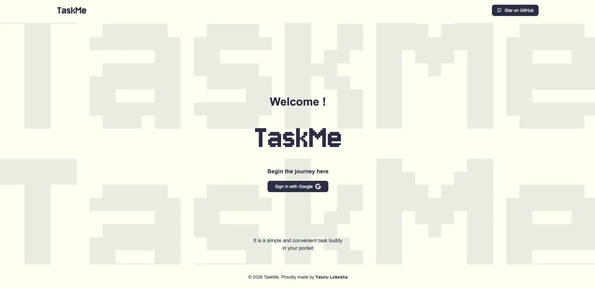

# TaskMe

> A simple and convenient task buddy in your pocket.

TaskMe is a clean, distraction-free task management app with a pixel-art aesthetic. Sign in with Google, create tasks with due dates and notes, and stay on top of what's coming up — or what's already overdue.

🔗 **Live demo:** [task-me-lilac.vercel.app](https://task-me-lilac.vercel.app)

---

## ✨ Features

- 🔐 **Google Sign-In** — one-click authentication, no passwords to remember
- 📝 **Create tasks** with a title, due date, and rich notes
- 📅 **Calendar-based date picker** for intuitive scheduling
- ⏳ **Smart status indicators** — see at a glance which tasks are due today (`0 Days left`), upcoming (`6 Days left`), or overdue (`Overdue for 5 Days`)
- ✅ **Pending / Completed** task views with a single toggle
- 🔃 **Sort tasks** from latest to oldest
- 🗓️ **Grouped by due date** so your day is laid out clearly
- 🎨 **Theme customization** via the sidebar palette
- 🚪 **Secure logout** with session handling

---

## 🖼️ Screenshots

### Welcome Screen


### Create a Task
.webp>)

### Task Details
.webp>)

### All Tasks View
.webp>)

---

## 🛠️ Tech Stack

**Frontend**
- ⚡ Vite + React + TypeScript
- 🎨 Tailwind CSS
- 🛣️ React Router
- 📡 Axios (with `withCredentials` for session-based auth)
- 🧩 React Context API for auth state

**Backend**
- 🟢 Node.js + Express
- 🍃 MongoDB (with Mongoose)
- 🔑 Passport.js for Google OAuth 2.0
- 🍪 express-session for session management

**Deployment**
- ▲ Vercel (frontend + backend)
- 🐳 Docker support (Future Updates)

---

## 📁 Project Structure

```
TaskMe/
├── backend/              # Express API + auth + database
│   └── src/
│       ├── config/       # DB connection, passport strategy
│       ├── controllers/  # Request handlers
│       ├── models/       # Mongoose schemas (User, Task)
│       ├── routes/       # Express routes
│       ├── middleware/   # Auth guards, error handling
│       └── index.ts      # Server entry point
│
├── frontend/             # Vite + React + TS client
│   └── src/
│       ├── components/   # UI components (TaskCard, Modals, Sidebar)
│       ├── pages/        # Home, Tasks, Login
│       ├── context/      # AuthContext provider
│       ├── hooks/        # Custom hooks
│       ├── services/     # API calls
│       └── App.tsx       # Routes
│
├── vercel.json
└── README.md
```

---

## 🚀 Getting Started

### Prerequisites

- Node.js 20+
- npm or yarn
- MongoDB (local or MongoDB Atlas)
- Google OAuth 2.0 credentials ([get them here](https://console.cloud.google.com/apis/credentials))

### 1. Clone the repository

```bash
git clone https://github.com/yasirulokesha/TaskMe.git
cd TaskMe
```

### 2. Set up the frontend

```bash
cd ../frontend
npm install
```

Create a `.env` file in `frontend/`:

```env
VITE_API_URL=http://task-me-chi.vercel.app
```

Start the frontend:

```bash
npm run dev
```

Visit [http://localhost:5173](http://localhost:5173) — you're in! 🎉

---

## 🐳 Running with Docker

```bash
docker build -t taskme .
docker run -p 5000:5000 --env-file backend/.env taskme
```

---

## 🌐 Deployment

### Frontend (Vercel)
1. Import the repo into Vercel
2. Set **Root Directory** to `frontend`
3. Set **Framework Preset** to `Vite`
4. Add `VITE_API_URL` pointing to your deployed backend

### Backend (Vercel / Render / Railway)
1. Set environment variables (see `.env` above)
2. Make sure cookies use `sameSite: "none"` and `secure: true` for cross-origin auth
3. Whitelist your frontend domain in CORS settings

---

## 🗺️ Roadmap

- [ ] Recurring tasks (daily, weekly, custom)
- [ ] Task categories / tags
- [ ] Reminders & push notifications
- [ ] Drag-and-drop reordering
- [ ] Mobile app (React Native)
- [ ] Multi-user task sharing
- [ ] Dark mode

---

## 🤝 Contributing

Contributions are welcome! Here's how:

1. Fork the repo
2. Create a feature branch (`git checkout -b feature/amazing-feature`)
3. Commit your changes (`git commit -m 'Add amazing feature'`)
4. Push to the branch (`git push origin feature/amazing-feature`)
5. Open a Pull Request

---

## 📜 License

This project is licensed under the MIT License — see the [LICENSE](LICENSE) file for details.

---

## 👤 Author

**Yasiru Lokesha**

- GitHub: [@yasirulokesha](https://github.com/yasirulokesha)

---

<div align="center">

© 2026 TaskMe. Proudly made by **Yasiru Lokesha**

⭐ If you like this project, give it a star on GitHub!

</div>
